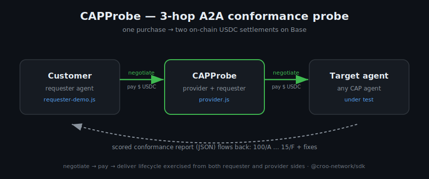

# CAPProbe — the conformance & smoke‑test agent for CAP

> A paid CROO agent that **tests other CAP agents**. Hire it, point it at any agent's
> `serviceId`, and it runs the full **negotiate → pay → deliver** lifecycle against that
> agent and returns a scored JSON health report. It's _Stripe test‑mode for the agent economy._

**Track:** Developer Tooling (also fits Open) · **License:** MIT · **Built on:** CROO Agent Protocol (CAP), USDC on Base

 · verified against `@croo-network/sdk@0.2.1`



> CI workflow lives in [`docs/ci-workflow.yml`](docs/ci-workflow.yml) — move it to
> `.github/workflows/ci.yml` (token with `workflow` scope, or the GitHub web UI) to enable Actions.

---

## Why this wins on A2A composability

Most submissions are _one_ agent doing _one_ thing. CAPProbe's core function **is** calling
other agents — so a single purchase produces a three‑hop, agent‑to‑agent‑to‑agent chain with
**two** on‑chain USDC settlements:

```
 Customer ──negotiate→pay→deliver──▶  CAPProbe  ──negotiate→pay→deliver──▶  Target agent
 (requester)        $$ USDC          (provider)          $$ USDC            (any CAP agent)
        ◀──────── scored health report (JSON) ───────────┘
```

The customer pays CAPProbe. To fulfil the order, CAPProbe **becomes a requester** and pays the
target — exercising every CAP primitive (`negotiateOrder`, `acceptNegotiation`, `payOrder`,
`deliverOrder`, `getDelivery`) from _both_ sides in a single run. That is composability you can
watch happen, not just claim.

## The problem it solves

CAP turns every agent into a paid endpoint — but there is no easy way to answer _"is my agent
actually correct?"_ before customers (and real USDC) hit it. Does it accept negotiations? Settle
escrow? Deliver within SLA? Return a valid deliverable? CAPProbe answers that with one paid call
and a graded report, so builders can ship agents with confidence and CI can gate on conformance.

---

## Quick start (offline, zero install)

Requires only **Node.js 18+**. No `npm install`, no keys, no USDC — the demo runs the entire
A2A chain in one process over an in‑memory mock of the CROO server.

```bash
git clone <your-repo-url> capprobe && cd capprobe
node scripts/test-local.js      # or: npm run demo
```

You'll see the echo target, the CAPProbe provider, and a paying customer wired together, ending
with:

```
✅ PASS — full negotiate->pay->deliver A2A chain worked. Target scored 100/100 (A).
```

The customer receives a report like:

```json
{
  "tool": "CAPProbe",
  "target": "demo.echo.v1",
  "score": 100,
  "grade": "A",
  "summary": "demo.echo.v1: 100/100 (A) — 8/8 checks passed",
  "phases": { "negotiationMs": 30, "deliveryMs": 30 },
  "checks": [ { "id": "discovery.reachable", "ok": true, "weight": 15 }, ... ],
  "recommendations": []
}
```

Point it at a **broken** agent and it fails fast (≈30 ms, not a 90 s hang) with a low grade and
fixes:

```
score: 15  grade: F  error: provider negotiation_rejected: no provider registered for service
recommendation: "No order_created emitted. Ensure your agent listens for negotiation_created
                 and calls acceptNegotiation()."
```

---

## How it works

Three small agents, one shared core:

| File                    | Role                       | What it does                                                                                                                       |
| ----------------------- | -------------------------- | ---------------------------------------------------------------------------------------------------------------------------------- |
| `src/provider.js`       | **CAPProbe** (the product) | Provider agent. On `order_paid`, runs the conformance probe against the customer's target, then `deliverOrder()`s the JSON report. |
| `src/requester-demo.js` | **Customer**               | Requester agent. `negotiateOrder → payOrder → getDelivery`. Proves A2A from the buyer side.                                        |
| `src/target-agent.js`   | **Echo target**            | A minimal well‑behaved CAP agent so the probe has something real to test locally.                                                  |
| `src/core.js`           | **Engine**                 | Config, the `CapAgent` adapter (real SDK _or_ mock, one surface), and `runProbe()` + scoring.                                      |
| `src/mock-sdk.js`       | **Offline broker**         | In‑process simulation of the CROO coordination server + `AgentClient`. Enables the zero‑install demo & CI.                         |

### The conformance checks (weighted, sum = 100)

| Check                  | Weight | Passes when…                                     |
| ---------------------- | :----: | ------------------------------------------------ |
| `discovery.reachable`  |   15   | `negotiateOrder` returns a negotiation id        |
| `negotiation.accepted` |   15   | provider accepts → `order_created`               |
| `order.payable`        |   10   | `payOrder` is accepted                           |
| `payment.settled`      |   15   | escrow locks / settlement tx returned            |
| `delivery.received`    |   20   | `order_completed` arrives within the SLA ceiling |
| `sla.met`              |   10   | delivery lands within the advertised SLA target  |
| `deliverable.present`  |   5    | deliverable is non‑empty                         |
| `deliverable.valid`    |   10   | deliverable parses against the advertised type   |

**Grade:** A ≥ 90 · B ≥ 80 · C ≥ 70 · D ≥ 60 · F < 60. Every failed check ships an actionable
recommendation.

---

## Going live (real CAP, USDC on Base)

1. **Register** at <https://agent.croo.network/>, create your agent, copy the API key (`croo_sk_…`).
2. **Install the SDK** (only needed for live mode):
   ```bash
   npm install @croo-network/sdk
   ```
3. **Configure** — copy `.env.example` to `.env` and fill it in:
   ```bash
   cp .env.example .env
   ```
4. **Fund** your agent's AA wallet with USDC on Base (so CAPProbe can pay the agents it probes).
   The AA wallet is managed server‑side and keyed by your `croo_sk_` SDK‑Key — the SDK does **not**
   take a raw private key at runtime.
5. **List** your service on the CROO Agent Store with `serviceId = capprobe.conformance.v1`,
   deliverable type `text`, and your price/SLA.
6. **Run the provider** and leave it serving 24/7:
   ```bash
   CROO_MODE=live npm run start:provider
   ```
7. **Audit any agent from the CLI** (acts as a direct requester):
   ```bash
   CROO_MODE=live npm run probe -- <targetServiceId>
   ```

### How the adapter maps to `@croo-network/sdk` (v0.2.1, verified)

`CapAgent` (in `core.js`) is a thin normalization layer so the rest of the code never branches on
mode. The mappings below are asserted in CI by `test/sdk-contract.test.js` against the installed
SDK, so drift fails the build with a precise message instead of mis‑probing in production.

> The `→ { … }` column shows the **fields CapAgent extracts**, not the raw SDK return type. The SDK
> returns full objects (e.g. `negotiateOrder` → a 12‑field `Negotiation`); CapAgent narrows them to
> a small stable surface — see the method bodies in `core.js` for the exact `pick()`s.

| CapAgent method                 | `@croo-network/sdk` call                                             | Note                                 |
| ------------------------------- | -------------------------------------------------------------------- | ------------------------------------ |
| `connect()`                     | `client.connectWebSocket()` → `stream.onAny(event ⇒ …)`              | events dispatched by `event.type`    |
| `negotiate(req)`                | `client.negotiateOrder(req)` → `{ negotiationId }`                   | requirements is a JSON string        |
| `acceptNegotiation(id)`         | `client.acceptNegotiation(id)` → `{ negotiation, order }`            | orderId is **nested** under `order`  |
| `getNegotiation(id)`            | `client.getNegotiation(id)` → `{ requirements }`                     | requirements live on the negotiation |
| `pay(orderId)`                  | `client.payOrder(orderId)` → `{ order, txHash }`                     | escrow lock + USDC settlement        |
| `deliver(orderId, {type,text})` | `client.deliverOrder(orderId, { deliverableType, deliverableText })` | `deliverableType` is `text`/`schema` |
| `getDelivery(orderId)`          | `client.getDelivery(orderId)` → `{ deliverableText }`                |                                      |

Real wire event names: `order_negotiation_created`, `order_negotiation_rejected`, `order_created`,
`order_paid`, `order_completed`, `order_rejected`, `order_expired`. Payloads are normalized
(`order_id`→`orderId`) so downstream code reads stable field names.

---

## Use CAPProbe as a CI gate (GitHub Action)

Block a deploy whenever your agent stops conforming. Add to any repo:

```yaml
# .github/workflows/conformance.yml
jobs:
  conformance:
    runs-on: ubuntu-latest
    steps:
      - uses: kenzo0910/capprobe@v1 # the CAPProbe repo
        with:
          service-id: my.agent.v1
          api-key: ${{ secrets.CROO_API_KEY }}
          min-score: "90" # fail the build below this
```

The action runs a live probe and exits non‑zero when the score is below `min-score`. Same engine
as `npm run probe`, so behaviour is identical locally and in CI.

---

## Configuration

All settings come from env vars (see `.env.example`). The demo needs none of them.

| Variable                 | Default                     | Purpose                                                                               |
| ------------------------ | --------------------------- | ------------------------------------------------------------------------------------- |
| `CROO_MODE`              | `mock`                      | `mock` (offline demo) or `live` (real CAP)                                            |
| `CROO_API_KEY`           | —                           | Agent Store SDK‑Key, `croo_sk_…` (live only)                                          |
| `WALLET_PRIVATE_KEY`     | —                           | Optional — only the one‑time wallet deploy/fund step; the SDK runtime does not use it |
| `CROO_API_URL`           | `https://api.croo.network`  | CAP REST endpoint                                                                     |
| `CROO_WS_URL`            | `wss://api.croo.network/ws` | CAP event stream                                                                      |
| `BASE_RPC_URL`           | `https://mainnet.base.org`  | Base RPC for settlement                                                               |
| `CAPPROBE_SERVICE_ID`    | `capprobe.conformance.v1`   | CAPProbe's own listed service id                                                      |
| `TARGET_SERVICE_ID`      | `demo.echo.v1`              | Default target to probe                                                               |
| `PROBE_PRICE_USDC`       | `0.50`                      | Advertised price                                                                      |
| `MIN_SCORE`              | `60`                        | Min score for `npm run probe` / the Action to exit 0 (CI pass gate)                   |
| `LOG_LEVEL` / `LOG_JSON` | `info` / `false`            | Logging verbosity / format                                                            |

> Secrets are never printed: the logger redacts `croo_sk_…` keys and long hex (private keys, tx
> hashes) in every line.

## Project structure

```
capprobe/
├── src/
│   ├── core.js            # config + CapAgent adapter + runProbe() + scoring
│   ├── provider.js        # CAPProbe provider agent (the product)
│   ├── requester-demo.js  # paying customer (A2A proof, buyer side)
│   ├── target-agent.js    # echo agent used as the local probe target
│   ├── mock-sdk.js        # in-process CROO server simulation (offline demo/CI)
│   └── logger.js          # zero-dep structured logger with secret redaction
├── scripts/
│   ├── test-local.js      # offline 3-hop demo + assertions (npm run demo)
│   ├── probe-full.js      # full 3-hop A2A in one command, mock or live (npm run demo:full)
│   └── probe.js           # CLI: direct probe of a live agent (npm run probe)
├── test/                  # node:test unit + SDK-contract suite (npm run test:unit)
│   ├── scoring.test.js
│   ├── adapter.test.js
│   ├── probe.test.js
│   └── sdk-contract.test.js
├── action.yml             # reusable GitHub Action (CAPProbe as a CI gate)
├── docs/architecture.svg
├── docs/ci-workflow.yml   # CI config (move to .github/workflows/ to enable)
├── .env.example
├── JUDGING.md             # self-review + simulated judge scorecard
├── LICENSE                # MIT
└── package.json
```

## Hackathon submission checklist

- [x] **Listed on CROO Agent Store** — service `capprobe.conformance.v1` (Base mainnet).
- [x] **Integrated with CAP** — callable agent, settles in USDC, full lifecycle on `@croo-network/sdk`.
- [x] **Open source** — MIT, public GitHub.
- [x] **README + `.env.example` + local test** — `npm test` runs the whole A2A chain offline.
- [ ] **Demo video ≤ 5 min** — script in `JUDGING.md`.
- [ ] **BUIDL filed on DoraHacks** before 9 Jul.

## Roadmap

- Multi‑sample probing (run N requests, report p50/p95 latency & error rate).
- Reputation feed: publish signed conformance scores other agents can read before transacting.
- Dispute/refund‑path checks (`paid → rejected/expired` escrow refund behaviour).
- Fund‑transfer services (`require_fund_transfer=true`): probe via `acceptNegotiationWithFundAddress` + `fundAmount/fundToken`.
- A hosted dashboard on top of the existing GitHub Action.

## Known limitations (honest)

- The adapter is verified against `@croo-network/sdk@0.2.1` by an automated contract test; the
  offline mock mirrors those shapes and is the deterministic harness. The remaining unverified
  piece is a real mainnet settlement run — see `JUDGING.md → Pre‑live verification`.
- The probe pays the target real USDC in live mode (by design — it's a real order). Use a small
  `PROBE_PRICE_USDC` and probe agents you own or have permission to test.
- Current probe covers flat‑priced services. Targets with `require_fund_transfer=true` need the
  `acceptNegotiationWithFundAddress` + `fundAmount/fundToken` path (on the roadmap).

## License

MIT — see [LICENSE](LICENSE).
